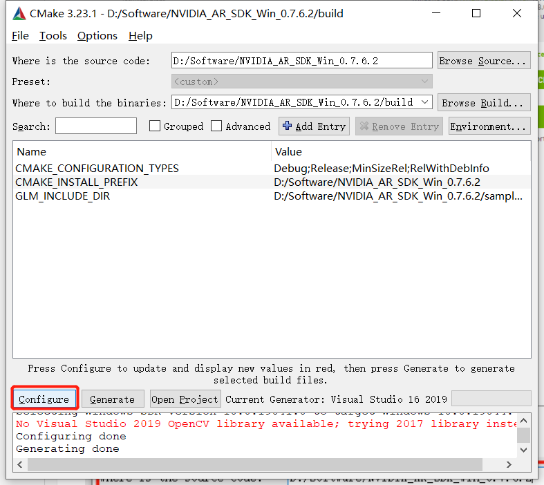

# 姿势识别极简教程

随着AI技术的发展, 数字内容创建业务也变得越来越火热。人脸美化，身材修图，虚拟姿势和背景等功能也让我们的照片视频等数字内容越来越丰富。而在这些功能背后，离不开姿势识别，人脸特征点识别，虚拟背景，现实增强等技术的支持。

NVIDIA Maxine是一套GPU加速的SDK，它用人工智能重塑了音频和视频，提升了标准麦克风和摄像头的能力。Maxine提供最先进的实时人工智能音频、视频和增强现实功能，可内置到端到端深度学习流程中。使用一个标准的摄像头，使实时身体姿态识别成为可能。能够让您享受有趣、迷人的AR效果。

下载地址: https://developer.nvidia.com/maxine-getting-started#augmented-reality-sdk

## 环境配置

1. Windows 10 64位
2. CUDA 10及以上
3. NVIDIA驱动 465.89及以上
4. VS 2015及以上
5. CMake 3.12及以上
   
环境配置相当简单, 如果你只是想运行示例, 那么你只需要访问https://developer.nvidia.com/maxine-getting-started#augmented-reality-sdk来下载SDK即可

如果你想进行深入的开发, 那么请遵循以下步骤:

1. 将下载的文件解压
2. 打开CMake将解压的文件路径输入给source

3. 接下来在CMake中填入build文件夹, 如下图所示

4. 点击configure, 如下图所示

5. 点击generate生成项目, 如下图所示

## 运行

打开.......\NVIDIA_AR_SDK_Win_0.7.6.2\samples\BodyTrack目录, 里面会有一个`run_local.bat`, 插好摄像头, 双击打开就可以运行了

如果你想深入了解, 可以利用VS打开生成的解决方案

